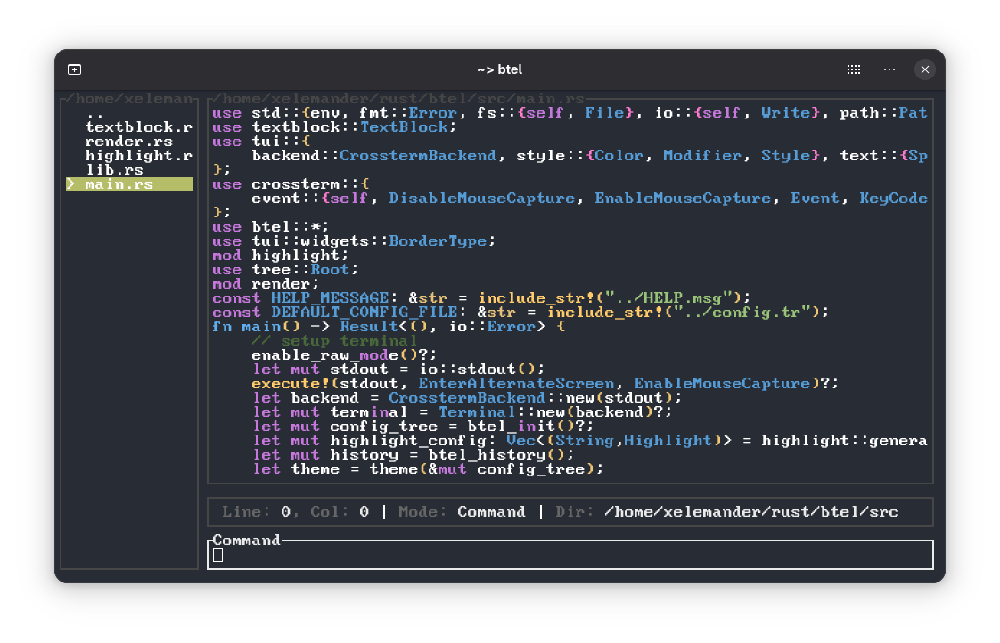

# Btel Text Editor 
> **B**ad **T**ext **E**ditor **L**ol

A simple hobby project text editor written in rust


## Features
- Opening and Saving files
- Scrolling
- Searching for text
- Executing shell commands
- Plugin support
- Syntax highlighting for 
  - rust
  - json 
  - any other language if you [configure](#configuration) it
- Status Bar

## Install
To install run:
```shell
cargo install --git https://github.com/xelezard/btel.git btel
```

## Usage
When opening Btel you see two fields the "New File" and the "Command" block.

Currently, you are in the command block.

Type a command into "Command" field to execute it. (Command explanation below)

Use the "edit" command to go into edit mode.

### Commands
Note: each command has short versin (command -> c)

#### edit or e
close the command block and enter the edit mode

to go back press esc

#### quit or q
if everything is saved exit btel

#### open or o
if everything is saved open the specified file

> open file.txt

#### save or s
save the currently opened file with the specified file name

if no name was specified, the file will be saved as its current name

#### find or f
temporarily replace the command line with a search field

press esc to bring back the command line

#### force_save or fs
enforce the saved state

this will let you exit and open new files without actually saving 

#### help or h
bring back the help message that was displayed at the start

## Configuration
The config file is located at:

linux -> ~/.btel/config.tr

windows -> %AppData%/btel/config.tr

### Plugins
Configure your plugins like this
```
commands -> alt text
| cmd1 or cmd2 -> path/to/plugin
| other_cmd1 or other_cmd2 -> path/to/other/plugin
```

Note: you can technically have infinite commands for one plugin
```
| cmd1 or cmd2 or cmd3 or cmd4 ...
```
### Themes
You configure which theme to use like this:
```
theme -> classic
#or
theme -> modern
#or
theme -> clear
#or 
theme -> red-and-blue
#or 
theme -> green
``` 
or configure a custom one like this:
```
# a recreation of the 'green' theme
theme -> custom
| border_type -> Rounded
| target -> Green
| no_target -> LightGreen
```
where target and no_target are the colors for blocks when being targeted or not

any border type from the 'tui::widgets::BorderType' enum can be used for border_type 
### Syntax highlighting
You can configure which file extensions get highlighted with internal highlighting like this:
```
highlighting -> declare your syntax highlighting rules here
| .rs -> rust
| .json -> json
```

To configure your own highlighting use:
```
| .ext -> custom
```
You can highlight brackets like this:
```
|| brackets -> _start_end_
```
where start is the opening bracket and end the closing one

And regex matches like this:
```
regex1 -> Green
regex2 -> 12, 23, 4
```
Note: You can either use any color from the 'tui::style::Color' enum or an rgb value that is split like this
> r, g, b

### Status Bar
You can choose one of this for your status bar
```
# in config.tr

stat-bar -> clear
# or
stat-bar -> standard
# or
stat-bar -> custom
| 1 -> pos
| 2 -> mode
| 3 -> dir
```
Note: the numbers used in the custom declaration actually don't matter
Note: for the custom declaration you can use one of these three options
- pos (Line: 0, Col: 2)
- mode (Mode: Edit)
- dir (Dir: your/working/dir)

## Plugins
Plugins are external commands configured in the 'commands' section of the config.tr

A test plugin is located at [test_plugin/](test_plugin/)

### Writing plugins
To write a plugin first of all import btel

```bash
cargo add --git https://github.com/Xelezard/btel btel
```

A plugin must allways be built up like this:
```rust
use btel::{get_btel_vars,set_btel_vars};
fn main() {
    let args = std::env::args().collect();
    let mut vars = get_btel_vars(args);
    do_smth();
    set_btel_vars(vars);
}
```
otherwise it won't work